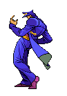

# 👋 Olá, eu sou Antônio

## 💻 Desenvolvedor Junior

### 🛠️ Tecnologias & Ferramentas

  
  

## 📊 Estatísticas do GitHub
  

  
  

## 🚀 Sobre mim
Jovem desenvolvedor de 16 anos com paixão por tecnologia e inovação. Acredito que a tecnologia é a chave para um mundo melhor e estou comprometido em aprimorar constantemente minhas habilidades técnicas para contribuir com esse avanço. Estudante dedicado e entusiasta de desenvolvimento de software, busco minha primeira oportunidade profissional para aplicar e expandir meus conhecimentos.

## 📌 Projetos em Destaque
- [**QuickMenu**](https://github.com/AntonioV1ctor/QuickMenu) - Precisa criar cardápios de modo rápido e facil? QuickMenu Resolve seus problemas!
- [**Together**](https://github.com/VoucherDesenvSenacHub/together) - Sua Ong não a visibilidade desejada? Isso acontece porque você não conhece o Together.

## 📚 Formação
- **Curso Técnico** - Curso Técnico de Desenvolvimento de Sistemas.
